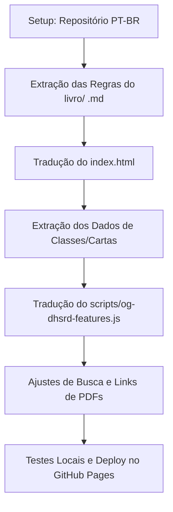

# Plano de Tradução e Nomenclatura: Daggerheart SRD em Português

Este documento descreve o plano detalhado para criar um clone em português do repositório [og-dhsrd](https://github.com/callmepartario/og-dhsrd), que hospeda o System Reference Document (SRD) do sistema Daggerheart de forma organizada e interativa.

Utilizaremos como base os arquivos traduzidos do livro em formato Markdown localizados na pasta [livro](file:///home/gustavo_cc/Docs/Daggerheart/livro) para garantir a consistência de termos e a nomenclatura oficial adotada.

---

## 1. Glossário de Nomenclatura e Tradução

A partir da análise dos capítulos traduzidos em [livro](file:///home/gustavo_cc/Docs/Daggerheart/livro), consolidamos o glossário de termos chave. Ele servirá de base para a tradução do SRD:

### Recursos e Mecânicas de Jogo
*   **Hope** $\rightarrow$ **Esperança** (Dado de Esperança / Pontos de Esperança)
*   **Fear** $\rightarrow$ **Medo** (Dado de Medo / Pontos de Medo)
    > [!IMPORTANT]
    > **Esclarecimento sobre a sugestão original:** "Fear" foi traduzido como **Medo**. O termo traduzido como **PF (Pontos de Fadiga)** é **Stress** (estresse), que em termos mecânicos é marcado pelos jogadores e recuperado com sucessos críticos ou interlúdios.
*   **Stress** $\rightarrow$ **Fadiga** (Pontos de Fadiga - **PF**)
*   **Duality Dice** $\rightarrow$ **Dados de Dualidade**
*   **Hit Points (HP)** $\rightarrow$ **Pontos de Vida** (**PV**)
*   **Armor Slots / Armor Points** $\rightarrow$ **Pontos de Armadura** (**PA**)
*   **Evasion** $\rightarrow$ **Evasão**
*   **Action Roll** $\rightarrow$ **Teste de Ação** (ou apenas **Teste**)
*   **Reaction Roll** $\rightarrow$ **Teste de Reação**
*   **Damage Roll** $\rightarrow$ **Rolagem de Dano**
*   **Difficulty** $\rightarrow$ **Dificuldade**
*   **Advantage / Disadvantage** $\rightarrow$ **Vantagem** / **Desvantagem**
*   **Tier** $\rightarrow$ **Patamar**
*   **Level** $\rightarrow$ **Nível**
*   **Proficiency** $\rightarrow$ **Proficiência**
*   **Experience** $\rightarrow$ **Experiência**
*   **Loadout / Vault** $\rightarrow$ **Mão (ou Cartas Ativas)** / **Reserva**

### Atributos (Traits)
*   **Agility** $\rightarrow$ **Agilidade**
*   **Strength** $\rightarrow$ **Força**
*   **Finesse** $\rightarrow$ **Acuidade**
*   **Instinct** $\rightarrow$ **Instinto**
*   **Presence** $\rightarrow$ **Presença**
*   **Knowledge** $\rightarrow$ **Conhecimento**

### Alcances (Ranges)
*   **Melee** $\rightarrow$ **Corpo a corpo**
*   **Very Close** $\rightarrow$ **Muito próximo**
*   **Close** $\rightarrow$ **Próximo**
*   **Far** $\rightarrow$ **Distante**
*   **Very Far** $\rightarrow$ **Muito distante**
*   **Out of Range** $\rightarrow$ **Fora de alcance**

### Domínios (Domains)
*   **Arcana** $\rightarrow$ **Arcano**
*   **Blade** $\rightarrow$ **Lâmina**
*   **Bone** $\rightarrow$ **Falange**
*   **Codex** $\rightarrow$ **Códice**
*   **Grace** $\rightarrow$ **Graça**
*   **Midnight** $\rightarrow$ **Meia-noite**
*   **Sage** $\rightarrow$ **Sabedoria**
*   **Splendor** $\rightarrow$ **Esplendor**
*   **Valor** $\rightarrow$ **Valor**

### Classes e Subclasses
*   **Bard** $\rightarrow$ **Bardo**
    *   *Troubadour* $\rightarrow$ **Trovador**
    *   *Wordsmith* $\rightarrow$ **Beletrista**
*   **Druid** $\rightarrow$ **Druida**
    *   *Warden of the Elements* $\rightarrow$ **Protetor dos Elementos**
    *   *Warden of Renewal* $\rightarrow$ **Protetor da Renovação**
*   **Sorcerer** $\rightarrow$ **Feiticeiro**
    *   *Elemental Origin* $\rightarrow$ **Elementalista**
    *   *Primal Origin* $\rightarrow$ **Primordialista**
*   **Guardian** $\rightarrow$ **Guardião**
    *   *Stalwart* $\rightarrow$ **Baluarte**
    *   *Vengeance* $\rightarrow$ **Vingador**
*   **Warrior** $\rightarrow$ **Guerreiro**
    *   *Call of the Brave* $\rightarrow$ **Escolhido da Bravura**
    *   *Call of the Slayer* $\rightarrow$ **Escolhido da Matança**
*   **Rogue** $\rightarrow$ **Ladino**
    *   *Nightwalker* $\rightarrow$ **Gatuno**
    *   *Syndicate* $\rightarrow$ **Mafioso**
*   **Wizard** $\rightarrow$ **Mago**
    *   *School of Knowledge* $\rightarrow$ **Discípulo do Conhecimento**
    *   *School of War* $\rightarrow$ **Discípulo da Guerra**
*   **Ranger** $\rightarrow$ **Patrulheiro**
    *   *Wayfinder* $\rightarrow$ **Rastreador**
    *   *Beastbound* $\rightarrow$ **Treinador**
*   **Seraph** $\rightarrow$ **Serafim**
    *   *Divine Wielder* $\rightarrow$ **Portador Divino**
    *   *Winged Sentinel* $\rightarrow$ **Sentinela Alada**

### Ancestralidades (Ancestries) e Comunidades (Communities)
*   **Ancestralidades:**
    *   *Dwarf* $\rightarrow$ **Anão**
    *   *Firbolg* $\rightarrow$ **Firbolg**
    *   *Infernis* $\rightarrow$ **Infernis**
    *   *Clank* $\rightarrow$ **Clank**
    *   *Fungril* $\rightarrow$ **Fungril**
    *   *Katari* $\rightarrow$ **Katari**
    *   *Drakona* $\rightarrow$ **Drakona**
    *   *Galapa* $\rightarrow$ **Galapa**
    *   *Orc* $\rightarrow$ **Orc**
    *   *Elf* $\rightarrow$ **Elfo**
    *   *Giant* $\rightarrow$ **Gigante**
    *   *Halfling* $\rightarrow$ **Pequenino**
    *   *Faerie* $\rightarrow$ **Fada**
    *   *Goblin* $\rightarrow$ **Goblin**
    *   *Ribbit* $\rightarrow$ **Quacho**
    *   *Faun* $\rightarrow$ **Fauno**
    *   *Human* $\rightarrow$ **Humano**
    *   *Simian* $\rightarrow$ **Símio**
*   **Comunidades:**
    *   *Highborne* $\rightarrow$ **Aristocrática**
    *   *Slyborne* $\rightarrow$ **Fora da lei**
    *   *Wanderborne* $\rightarrow$ **Nômade**
    *   *Orderborne* $\rightarrow$ **Disciplinada**
    *   *Seaborne* $\rightarrow$ **Marítima**
    *   *Wildborne* $\rightarrow$ **Silvestre**
    *   *Loreborne* $\rightarrow$ **Erudita**
    *   *Ridgeborne* $\rightarrow$ **Montanhesa**
    *   *Underborne* $\rightarrow$ **Subterrânea**

---

## 2. Arquitetura do Repositório `og-dhsrd`

O repositório do site original é totalmente estático e roda no lado do cliente. Existem dois arquivos principais que concentram todo o conteúdo de regras e mecânicas:

1.  **[index.html](file:///home/gustavo_cc/Docs/Daggerheart/og-dhsrd/index.html)**:
    Contém a estrutura HTML do site, barra de navegação, painéis de leitura e o texto completo das regras estáticas do SRD (Capítulo 2: Jogando Aventuras, Capítulo 3: Conduzindo Aventuras, etc.).
2.  **[scripts/og-dhsrd-features.js](file:///home/gustavo_cc/Docs/Daggerheart/og-dhsrd/scripts/og-dhsrd-features.js)**:
    É a base de dados em formato de arrays JavaScript (`classesList`, `subclassList`, `ancestriesList`, `communitiesList`, `domaincardList`, etc.). Estes dados alimentam as funcionalidades dinâmicas do site, como:
    *   O criador interativo de personagens (Character Creator).
    *   Os popups e tooltips descritivos ao passar o mouse sobre os termos.
    *   O indexador e a barra de busca interativa do site.

---

## 3. Passos do Plano de Tradução e Implementação



### Passo 1: Inicialização do Repositório PT-BR
1. Criar um novo repositório chamado `og-dhsrd-pt` ou similar.
2. Copiar os arquivos base do repositório clonado [og-dhsrd](file:///home/gustavo_cc/Docs/Daggerheart/og-dhsrd) para este novo repositório.

### Passo 2: Tradução do `index.html` (Regras Estáticas)
1. Substituir os blocos de regras em inglês pelos capítulos correspondentes em português traduzidos do livro:
   *   Regras básicas $\rightarrow$ [02-jogando-aventuras.md](file:///home/gustavo_cc/Docs/Daggerheart/livro/02-jogando-aventuras.md)
   *   Regras do Mestre $\rightarrow$ [03-conduzindo-aventuras.md](file:///home/gustavo_cc/Docs/Daggerheart/livro/03-conduzindo-aventuras.md)
   *   Adversários $\rightarrow$ [04-adversarios-ambientes.md](file:///home/gustavo_cc/Docs/Daggerheart/livro/04-adversarios-ambientes.md)
2. Manter as âncoras HTML (`id="the-spotlight"`, `id="evasion"`, etc.) e links internos inalterados para evitar quebrar o CSS ou os scripts de navegação.

### Passo 3: Tradução do Banco de Dados (`og-dhsrd-features.js`)
Para cada estrutura na base de dados, mapear e substituir as strings em inglês pelas traduções obtidas nos arquivos Markdown:
*   **Classes (`classesList`):** Traduzir campos como `summary`, `hopefeature`, `features`, `questions`, `connections`, `qualities`, `clothes`, `attitudes`.
*   **Subclasses (`subclassList`):** Traduzir os campos `summary`, `foundation`, `specialization`, `mastery`.
*   **Ancestralidades e Comunidades (`ancestriesList` e `communitiesList`):** Traduzir descrições e habilidades específicas.
*   **Equipamento e Cartas de Domínio (`domaincardList`):** Esta é a maior lista, contendo todas as magias e habilidades do jogo. Será necessário um script automatizado ou tradução focada a partir de [apendice.md](file:///home/gustavo_cc/Docs/Daggerheart/livro/apendice.md).

### Passo 4: Localização dos Filtros e Ferramenta de Busca
No arquivo [scripts/og-dhsrd-features.js](file:///home/gustavo_cc/Docs/Daggerheart/og-dhsrd/scripts/og-dhsrd-features.js), a ferramenta de busca varre termos-chave em inglês. Devemos:
1. Traduzir as strings internas de busca.
2. Ajustar os tooltips no arquivo script para que apareçam em português ao passar o mouse por termos comuns (ex: *stress* $\rightarrow$ *fadiga*, *hope* $\rightarrow$ *esperança*).

---

## 4. Script Auxiliar de Automação de Tradução

Para facilitar a extração do conteúdo traduzido e reduzir o trabalho manual, podemos desenvolver scripts em Python localizados em `scripts/` para parsear as seções dos arquivos `.md` e gerar os fragmentos JS/JSON prontos para substituição.

Abaixo está um modelo de script em Python que extrai as habilidades das ancestralidades diretamente de [01-preparando-aventura.md](file:///home/gustavo_cc/Docs/Daggerheart/livro/01-preparando-aventura.md):

```python
import re
import json

def extrair_ancestralidades(caminho_arquivo):
    with open(caminho_arquivo, 'r', encoding='utf-8') as f:
        conteudo = f.read()

    # Regex para capturar os blocos de cada ancestralidade
    # Encontra os títulos de nível 1 (ex: # ANÃO) até a próxima seção ou fim da lista
    padrao_secao = re.compile(r'^# ([A-ZÁÉÍÓÚÂÊÎÔÛÃÕÇ]+)\n(.*?)(?=\n# [A-Z]|\Z)', re.MULTILINE | re.DOTALL)
    secoes = padrao_secao.findall(conteudo)
    
    ancestralidades = {}
    for titulo, texto in secoes:
        if titulo in ['INTRODUÇÃO', 'CAPÍTULO', 'DOMÍNIOS', 'CLASSES', 'COMUNIDADES']:
            continue
            
        # Extrai habilidades que começam com #### **HABILIDADES DE ANCESTRALIDADE**
        # E captura os nomes das habilidades em itálico e seus textos
        habilidades_padrao = re.compile(r'\*(.*?)\*:\s*(.*?)(?=\n\*|\Z)', re.DOTALL)
        habilidades = habilidades_padrao.findall(texto)
        
        ancestralidades[titulo] = {
            "descrição": texto.strip().split('\n')[0],
            "habilidades": {nome.strip(): desc.strip() for nome, desc in habilidades}
        }
        
    return ancestralidades

# Exemplo de uso:
# dados = extrair_ancestralidades('livro/01-preparando-aventura.md')
# print(json.dumps(dados, indent=2, ensure_ascii=False))
```

---

## 5. Próximos Passos e Ações Recomendadas

1.  **Validar o mapeamento de termos:** Confirme se concorda com os termos-chave traduzidos (especialmente **Falange** para *Bone*, **Acuidade** para *Finesse* e **Fadiga** para *Stress*).
2.  **Criação do Repositório do Clone:** Podemos rodar os comandos para inicializar a estrutura do clone local do site em português.
3.  **Desenvolvimento dos Parsers:** Escrever e rodar scripts Python para gerar a base de dados traduzida das cartas de domínio e classes em `scripts/og-dhsrd-features.js`.
